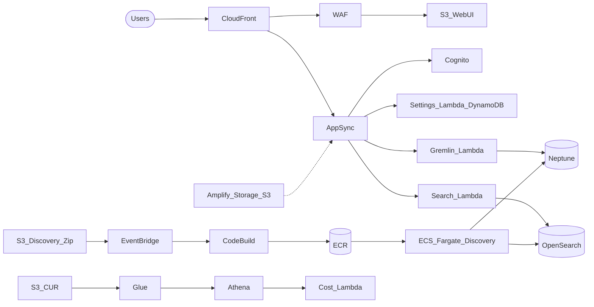

# Resource Lens — Infrastructure guide

This document explains **what [Resource Lens](../README.md) is for**, **what Terraform provisions**, **what you need before `terraform apply`**, and a **24-hour cost estimate** using **on-demand rates from the AWS Price List API** (queried via the AWS Pricing MCP). Region defaults match [`terraform.tfvars.example`](../terraform.tfvars.example): **`aws_region = "us-east-1"`**.

---

## 1. What is Resource Lens?

**Resource Lens** is an AWS-native **inventory and cost-insight platform**: a browser dashboard (static site behind **CloudFront**) talks to **AppSync** (GraphQL). AppSync calls **Lambda** functions that read/write **user settings** (**DynamoDB**), query a **Neptune** graph (relationships between resources), and **OpenSearch** (text search). A **discovery** service on **ECS Fargate** scans your account (via **AWS SDK** and optional **AWS Config**-style data) and keeps the graph/search indexes updated. A separate **Cost & Usage Report (CUR)** pipeline lands billing data in **S3**; **Glue** + **Athena** let a **cost Lambda** answer cost questions. **CodeBuild** builds container images from a zip in **S3** and pushes to **ECR** when you upload new artifacts.

---

## 2. Plain-language glossary

| Term | In one sentence |
|------|-----------------|
| **VPC / subnets** | Private network inside AWS; private subnets hold databases and ECS tasks without public IPs. |
| **NAT Gateway** | Lets private subnets reach the internet (e.g. pull images, call AWS APIs) outbound-only; billed hourly + per GB processed. |
| **Neptune** | Managed graph database (Gremlin) for “which resource connects to which.” |
| **OpenSearch** | Search engine for full-text search over resource metadata. |
| **AppSync** | Managed GraphQL API that routes queries/mutations to Lambda resolvers. |
| **Cognito** | User directory + JWTs so the SPA can sign in. |
| **CloudFront** | CDN that serves the web UI from S3 over HTTPS with a low-latency edge. |
| **WAF** | Web ACL attached to CloudFront to filter common attacks (extra monthly + per-request charges). |
| **ECS Fargate** | Runs containers without managing servers; pays per vCPU/memory-second. |
| **ECR** | Docker image registry for the discovery image. |
| **CodeBuild** | Builds the discovery image when you upload source to S3 (pay per build minute). |
| **CUR** | Detailed billing export to S3 (Parquet). |
| **Athena / Glue** | Athena runs SQL over S3; Glue holds table metadata for CUR paths. |
| **Amplify (here)** | App + optional Git connect; includes an **S3** bucket for extra static/storage patterns. |

---

## 3. Architecture diagram — numbered arrows (1–18)

The diagram in [`resource-lens-Architecture-Diagram.png`](resource-lens-Architecture-Diagram.png) matches the Terraform layout below.

| # | Flow (diagram) | Terraform / module |
|---|----------------|----------------------|
| 1 | Users → **CloudFront** | [`modules/web_ui`](../modules/web_ui/) — `aws_cloudfront_distribution` |
| 2 | CloudFront → **S3** (Web UI) | [`modules/web_ui`](../modules/web_ui/) — `aws_s3_bucket.webui` + OAC |
| 3 | Traffic → **WAF** → AppSync | [`modules/web_ui`](../modules/web_ui/) — `aws_wafv2_web_acl` (scope `CLOUDFRONT`, provider `us_east_1`) |
| 4 | **AppSync** GraphQL | [`modules/web_ui`](../modules/web_ui/) — `aws_appsync_graphql_api` + resolvers |
| 5 | **Settings Lambda** + **DynamoDB** | [`modules/web_ui`](../modules/web_ui/) |
| 7 | **Amplify** + storage bucket | [`modules/storage`](../modules/storage/) |
| 9 | **Gremlin / Search Lambdas** → Neptune / OpenSearch | [`modules/data`](../modules/data/) + wired from [`modules/web_ui`](../modules/web_ui/) |
| 10–13 | **CUR** S3 → **Glue** → **Athena** → **Cost Lambda** | [`modules/cost`](../modules/cost/) (`aws_cur_report_definition` uses **`aws.us_east_1`**) |
| 14 | **CodeBuild** (image build) | [`modules/image_deployment`](../modules/image_deployment/) |
| 15 | **ECR** | [`modules/discovery`](../modules/discovery/) |
| 16 | **ECS Fargate** discovery | [`modules/discovery`](../modules/discovery/) |
| 17–18 | Discovery uses **AWS Config** + **AWS SDK** | Config is **not created by this repo**; the diagram shows runtime dependencies. Enable Config separately if you want configuration history as a source. |

### Mermaid (high level)



---

## 4. What `terraform apply` creates (by module)

Root [`main.tf`](../main.tf) composes:

| Module | Creates (summary) |
|--------|-------------------|
| **Root** | Central **`aws_s3_bucket.access_logs`** for S3 server access logs (`prevent_destroy`). |
| **`networking`** | VPC, public/private subnets, IGW, NAT, route tables, security groups. |
| **`data`** | Neptune cluster + instance, OpenSearch domain, Gremlin/Search Lambdas, SQS DLQs, IAM, CloudWatch logs (`prevent_destroy` on **Neptune cluster** and **OpenSearch domain**). |
| **`web_ui`** | Web UI S3, CloudFront (optional WAF in **us-east-1**), Cognito, AppSync, Settings Lambda, DynamoDB (`prevent_destroy` on **web UI S3 bucket**). |
| **`discovery`** | Discovery S3, ECR, ECS cluster/service/task, IAM (`prevent_destroy` on **discovery bucket**). |
| **`image_deployment`** | CodeBuild + EventBridge (S3 object created → build). |
| **`cost`** | CUR bucket, Athena results bucket, CUR report definition, Athena workgroup, Glue DB + crawler, Cost Lambda, optional schedule (`prevent_destroy` on **CUR** and **Athena results** buckets). |
| **`storage`** | Amplify app/branch + **Amplify storage** S3 (`prevent_destroy`). |
| **`observability`** | SNS + CloudWatch alarms for Lambdas, Neptune, OpenSearch, ECS. |

### `prevent_destroy = true` (teardown note)

Terraform blocks destroy on these resources until you remove the lifecycle or change strategy:

| Resource | File |
|----------|------|
| Access logs bucket | [`main.tf`](../main.tf) |
| Web UI S3 bucket | [`modules/web_ui/main.tf`](../modules/web_ui/main.tf) |
| Neptune **cluster** | [`modules/data/main.tf`](../modules/data/main.tf) |
| OpenSearch **domain** | [`modules/data/main.tf`](../modules/data/main.tf) |
| CUR S3 bucket | [`modules/cost/main.tf`](../modules/cost/main.tf) |
| Athena results S3 bucket | [`modules/cost/main.tf`](../modules/cost/main.tf) |
| Discovery S3 bucket | [`modules/discovery/main.tf`](../modules/discovery/main.tf) |
| Amplify storage S3 bucket | [`modules/storage/main.tf`](../modules/storage/main.tf) |

---

## 5. Prerequisites checklist

### Tools

| Tool | Version / note |
|------|----------------|
| **Terraform** | `>= 1.5` ([`providers.tf`](../providers.tf)) |
| **AWS CLI** | v2 recommended |
| **Docker** | Optional; CodeBuild often uses privileged Docker for image builds |

### AWS account

- **Credentials** with broad IAM permissions: VPC, IAM, S3, KMS (if used), Neptune, OpenSearch, Lambda, AppSync, Cognito, CloudFront, **WAF in `us-east-1`**, ECS, ECR, CodeBuild, EventBridge, Glue, Athena, **billing/CUR**, Amplify, SNS, CloudWatch, DynamoDB.

### Dual region

- **`provider.aws`** uses `var.aws_region` (default **`us-east-1`**).
- **`provider.aws.us_east_1`** is required for **CloudFront-scoped WAF** and **CUR report definition** ([`providers.tf`](../providers.tf)). If `aws_region` is not `us-east-1`, you operate in **two regions**.

### Billing / CUR (critical)

- **`aws_cur_report_definition`** needs **Cost and Usage Reports** access from the correct **account role** (often **payer/management**). If you deploy only in a **member account** without billing API access, CUR creation can **fail**. Confirm IAM and organization billing settings before apply.

### Quotas

- VPC limits, **Elastic IP** for NAT, **Neptune** and **OpenSearch** service quotas in the target region.

### After first apply

1. Upload **`source/build.zip`** (or your module’s key) to the **discovery** bucket so **CodeBuild** can build and push **ECR** `:latest`.
2. Sync static web assets to the **web UI** bucket (or your pipeline).
3. Create a **Cognito** user and sign in; update **callback URLs** if not using localhost.
4. **Force ECS deployment** after new images: see [README — Operations](../README.md).

---

## 6. First deployment (commands)

From the repo root:

```bash
cp terraform.tfvars.example terraform.tfvars
# Edit terraform.tfvars

terraform init
terraform plan
terraform apply
```

See [README — Step-by-Step](../README.md) for detail.

---

## 7. Cost estimate — 24 hours (on-demand, `us-east-1`)

### Method

- Rates come from the **AWS Price List API** via **`get_pricing`** (AWS Pricing MCP), **OnDemand**, **US East (N. Virginia)** where applicable; **CloudFront** and **WAF** use **global / us-east-1** entries as returned by the API.
- **Monthly** prices (WAF Web ACL, rules, alarms) are **prorated to 24 hours** using **730 hours/month** (24/730).
- **Assumptions** match defaults in [`terraform.tfvars.example`](../terraform.tfvars.example): `neptune_instance_class = db.r6g.large`, `opensearch_instance_type = t3.medium.search`, `ecs_task_cpu = 512`, `ecs_task_memory = 1024`, `ecs_desired_count = 1`, `enable_waf = true`.
- **OpenSearch EBS** size is **20 GiB** per [`modules/data/main.tf`](../modules/data/main.tf) (`ebs_options.volume_size = 20`).
- **Neptune storage** is billed per GB-month; example uses **10 GiB** provisioned (adjust if your cluster uses more).

### Key unit rates (MCP query summary)

| Service | Filter / SKU attribute | Unit rate (USD) |
|---------|-------------------------|-----------------|
| **AmazonNeptune** | `instanceType = db.r6g.large`, `usagetype = InstanceUsage:db.r6g.large` | **$0.3287 / hour** |
| **AmazonNeptune** | `usagetype = StorageUsage` | **$0.10 / GB-month** |
| **AmazonES** | `instanceType = t3.medium.search` | **$0.073 / hour** |
| **AmazonEC2** | EBS **gp3** `volumeApiName = gp3` | **$0.08 / GB-month** |
| **AmazonEC2** | NAT `usagetype = NatGateway-Hours` | **$0.045 / hour** |
| **AmazonEC2** | NAT `usagetype = NatGateway-Bytes` | **$0.045 / GB** processed |
| **AmazonECS** | `usagetype = USE1-Fargate-vCPU-Hours:perCPU` | **$0.04048 / vCPU-hour** |
| **AmazonECS** | `usagetype = USE1-Fargate-GB-Hours` | **$0.004445 / GB-hour** |
| **awswaf** | `usagetype = USE1-WebACLV2`, group Web ACL | **$5.00 / Web ACL-month** (prorated) |
| **awswaf** | `usagetype = USE1-RuleV2`, group Rule | **$1.00 / rule-month** (prorated) |
| **awswaf** | `usagetype = USE1-RequestV2-Tier0` | **$0.60 / million requests** |
| **AmazonCloudFront** | `usagetype = ZA-DataTransfer-Out-Bytes`, first 10 TB tier | **$0.11 / GB** egress |
| **AmazonCloudFront** | `usagetype = US-Requests-Tier2-HTTPS` | **$0.01 / 10,000 HTTPS requests** |
| **AWSAppSync** | `usagetype = USE1-GraphQLInvocation` | **$4.00 / million query & data ops** |
| **AWSLambda** | `usagetype = Request` | **$0.20 / million requests** |
| **AWSLambda** | `usagetype = Lambda-GB-Second` (tier 1) | **$0.0000166667 / GB-second** |
| **AmazonDynamoDB** | On-demand read RU | **$0.125 / million RU** |
| **AmazonDynamoDB** | On-demand write RU | **$0.625 / million WU** |
| **AmazonS3** | Standard storage, first 50 TB tier | **$0.023 / GB-month** |
| **AmazonCloudWatch** | Logs ingest Standard | **$0.50 / GB** |
| **AmazonCloudWatch** | `usagetype = CW:AlarmMonitorUsage` | **$0.10 / alarm-month** |
| **AmazonAthena** | `usagetype = USE1-DataScannedInTB` | **$5.00 / TB scanned** |
| **AWSGlue** | `usagetype = USE1-Crawler-DPU-Hour` | **$0.44 / DPU-hour** |
| **AmazonECR** | Image storage | **$0.10 / GB-month** |
| **AWSConfig** | `usagetype = ConfigurationItemRecorded` | **$0.003 / configuration item** |

### Scenario A — **Idle baseline** (stack running, minimal traffic)

| Line item | Quantity (24 h) | Est. cost (USD) |
|-----------|-----------------|-----------------|
| Neptune `db.r6g.large` compute | 24 h × $0.3287 | $7.89 |
| Neptune storage (example 10 GB) | 10 × $0.10 × (24/730) | $0.03 |
| OpenSearch `t3.medium.search` | 24 h × $0.073 | $1.75 |
| OpenSearch EBS gp3 (20 GB) | 20 × $0.08 × (24/730) | $0.05 |
| NAT Gateway hourly | 24 × $0.045 | $1.08 |
| NAT data processing | 0 GB | $0.00 |
| Fargate vCPU (0.5 × 24 h) | 12 vCPU-h × $0.04048 | $0.49 |
| Fargate memory (1 GB × 24 h) | 24 GB-h × $0.004445 | $0.11 |
| WAF Web ACL V2 | $5 × (24/730) | $0.16 |
| WAF rules (2 rules in [`web_ui`](../modules/web_ui/main.tf)) | 2 × $1 × (24/730) | $0.07 |
| S3 Standard (~100 MB total) | prorated | ~$0.00 |
| ECR (~500 MB images) | prorated | ~$0.00 |
| CloudWatch Logs (~100 MB) | 0.1 GB × $0.50 | $0.05 |
| CloudWatch alarms (×8 standard) | 8 × $0.10 × (24/730) | $0.03 |
| AppSync / Lambda / Athena (no usage) | — | $0.00 |
| **Scenario A subtotal** | | **~$11.71** |

### Scenario B — **Light dev use** (adds to A)

Extra assumptions: **10k** AppSync GraphQL operations, **10k** Lambda invokes @ 256 MB × 200 ms, **10k** DynamoDB reads + **1k** writes (on-demand), **1 GB** CloudFront egress, **10k** HTTPS requests to CloudFront, **2 GB** NAT processed, **2** Athena queries × **100 MB** scanned, **1** Glue crawler run **10 min** × **2 DPU**, **+1 GB** CloudFront-to-viewer is already counted; **+1 GB** log ingest; WAF **10k** requests at Tier0.

| Add-on | Est. cost (USD) |
|--------|-----------------|
| NAT +2 GB processed | $0.09 |
| CloudFront egress 1 GB (first tier) | $0.11 |
| CloudFront HTTPS 10k requests | $0.01 |
| AppSync 10k queries ($4/M) | $0.04 |
| Lambda requests + compute (approx.) | $0.01 |
| DynamoDB reads/writes (approx.) | < $0.01 |
| Athena 0.0002 TB scanned | < $0.01 |
| Glue crawler ~0.33 DPU-h × $0.44 | ~$0.15 |
| Extra CloudWatch Logs +1 GB | $0.50 |
| WAF processed requests 10k (Tier0) | $0.006 |
| **Scenario B incremental** | **~$0.97** |
| **A + B (without AWS Config)** | **~$12.68 / 24 h** |

### AWS Config (not provisioned by this repo)

If **AWS Config** records **200 configuration items** in a day at **$0.003/CI**, that is **~$0.60/day** — often the largest **variable** cost outside this stack. Enable Config only where needed.

### Monthly extrapolation (order of magnitude)

- **~$11.7/day × 30 ≈ $350/month** idle baseline (Neptune + OpenSearch + NAT dominate).
- Light dev use adds roughly **$1/day** in this model (more if traffic or Config is high).

**Disclaimer:** Actual bills include **tax**, **Savings Plans**, **free tiers** (e.g. Lambda/Cognito for small usage), **data transfer** edge cases, and **Glue/Athena** frequency. Use **AWS Cost Explorer** and the **Pricing Calculator** before production commitments.

---

## 8. Cost reduction levers

| Lever | Effect |
|-------|--------|
| `enable_waf = false` | Removes WAF Web ACL + rule monthly charges (still review security). |
| Smaller `neptune_instance_class` | Largest single line item is usually Neptune compute. |
| `ecs_desired_count = 0` when not scanning | Stops Fargate charges (discovery idle). |
| Right-size OpenSearch / Neptune storage | Storage and IOPS charges add up over time. |
| VPC endpoints for **S3** / **DynamoDB** | Can reduce **NAT Gateway** data processing. |
| Reserved capacity / Savings Plans | Lower steady-state after you know usage. |

---

## 9. Teardown

1. Empty **versioned** S3 buckets (including access logs objects) that block `destroy`.
2. Adjust or remove **`lifecycle { prevent_destroy = true }`** where you accept data loss (or snapshot Neptune/OpenSearch first).
3. **Disable CUR** / billing artifacts in the console if required before deleting CUR buckets.
4. Run `terraform destroy` from a clean workspace.

---

## Appendix A — Terraform service inventory (MCP `analyze_terraform_project`)

The MCP reported AWS-related Terraform resources across modules, including: **VPC, subnet, NAT, EIP, Neptune, OpenSearch, Lambda, SQS, AppSync, Cognito, DynamoDB, CloudFront, WAFv2, ECR, ECS, CodeBuild, CUR, Athena, Glue, Amplify, SNS, CloudWatch**, and root **S3**. Use the same tool on this path to refresh after `.tf` changes.

---

## Appendix B — Pricing API notes

- The MCP tool **`generate_cost_report`** can format bundled pricing JSON; for this project the **line-item table in section 7** is the primary estimate (built from raw **`get_pricing`** responses, not the generic report template).
- Publication dates on price list entries were **2025–2026** at query time; AWS updates prices periodically.
- **Neptune** returned two SKUs for `db.r6g.large` (standard **InstanceUsage** vs **IO-Optimized**); this guide uses the **lower** hourly rate (`InstanceUsage:db.r6g.large`, **$0.3287/hr**). If your cluster uses **I/O-Optimized**, use the IO-optimized line from the Price List instead.
- **CloudFront** egress tier used **ZA-DataTransfer-Out-Bytes** first-tier **$0.11/GB** as returned for the global distribution SKU; your edge mix may differ slightly from **PriceClass_100** pricing in practice.

---

*Generated for the Resource Lens Terraform project. For operational commands and outputs, see the main [README](../README.md).*
